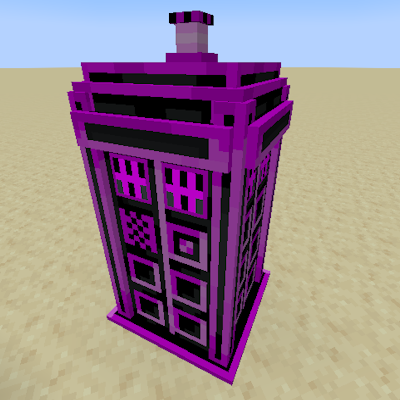
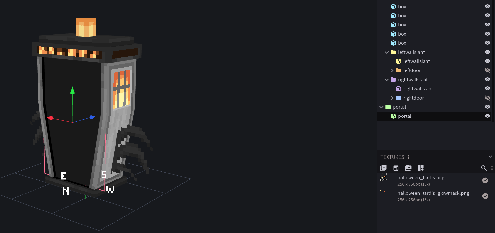

- TOC
{:toc}
* * *

# TARDIS Exteriors
With the update to 1.16.5, Dalek Mod added support for data pack TARDIS exteriors. This functionality is also present in 1.20.1 Dalek Mod, even though the process of adding custom exteriors has slightly changed.

In 1.20.1, TARDIS exterior JSON files have been split to two types: client JSON and server JSON. This is so that servers wouldn't have any unnecessary rendering data and to grant client side resource packs more freedom with the model and texture locations.

## Server Side
To get started with adding a custom TARDIS exterior with a data pack, create a new JSON file in `data/{modid}/tardis/exteriors/` folder.

Example exterior JSON file:
```json
{
    "name": {
        "translate": "dalekmod.tardis.name.anomalous_police_box"
    },
    "description": {
        "translate": "dalekmod.tardis.description.anomalous_police_box"
    },
    "entries": [
        "dalekmod:untextured_police_box"
    ],
    "unlockable": true,
    "exteriorLight": true
}
```

### Server Exterior JSON Properties

| Property                | Type                                                         | Description                                                         | Default               | Required |
| --------                | ----                                                         | -----------                                                         | -------               | -------- |
| `name`                  | [Component](https://misode.github.io/text-component/)        | The name of the exterior. Translatable components are recommended.   | N/A                   | ✅       |
| `description`                  | [Component](https://misode.github.io/text-component/)        | Exterior description that is shown in chameleon panel. Translatable components are recommended.   | N/A                   | ✅       |
| `exteriorLight`               | Boolean                                     | Whether the exterior should output light.                               | False                   | ❌       |
| `interior`               | [Resource Location]                                     | The default interior for this exterior.                               | "minecraft:"                   | ❌       |
| `entries`               | List\<[Entry](#entries)>                                     | The entries for this exterior.                               | N/A                   | ✅       |
| `unlocked_by_default`               | Boolean                                     | Whether the exterior is unlocked by default or needs to be unlocked.                               | False                   | ❌       |
| `default_exterior`               | Boolean                                     | Whether the exterior can be selected when first setting up the TARDIS.                               | False                   | ❌       |
| `unlockable`               | Boolean                                     | Whether the exterior can be unlocked.                               | True                   | ❌       |
| `sounds`                | [Sounds](#sounds)                                            | Sounds played by this exterior.                                  | (see default sounds)  | ❌       |
| `hitbox`               | List<Integer>                                     | Exterior collision shape.                               | [0, 0, 0, 16, 32, 16]                   | ❌       |
| `hitbox_visual`               | List<Integer>                                     | Visual shape of the exterior collision box.                               | [0, 0, 0, 16, 32, 16]                   | ❌       |
| `add_conditions`        | [AddConditions](../add_conditions)                           | Conditions for this exterior to be added                    | (none)                | ❌       |

### Entries
An entry is a [Resource Location] that points to a client exterior entry with the matching name. All exteriors must have at least one entry.

### Sounds
You can override the sounds that the exterior plays. The sounds are specified as [Resource Location]s for the value.

All sounds are optional, and will play the default when unset. You can set it to `minecraft:intentionally_empty` if you want no sound to be played

| Property                | Default                          | Description        |
| --------                | -------                          | -----------        |
| `open`                  | `dalekmod:tardis.police_box_door_open`,| Exterior door opening sound    |
| `close`                 | `dalekmod:tardis.police_box_door_close`| Exterior door closing sound            |
| `remat`                 | `dalekmod:tardis.flight_remat`  | TARDIS Landing/Rematerialization sound |
| `demat`                 | `dalekmod:tardis.flight_demat`| TARDIS Takeoff/Dematerialization sound    |

## Client Side
For exteriors to have a model, texture, animations and even [BOTI support](#configuring-boti) they need another JSON file on the client side. That JSON must be located at `assets/{modid}/tardis/exteriors/`.

Both client and server exterior JSONS **must** have the same file name!

Example client exterior JSON file:
```json
{
    //Exterior Entry Resource Location
    "dalekmod:pillar": {
        "model": "dalekmod:geo/tardis/pillar.geo.json", //Required: Model for this exterior enty
        "texture": "dalekmod:textures/tardis/pillar.png", //Required: Texture for this exterior enty
        "animation": "dalekmod:animations/tardis/pillar.animation.json", //Required: Animation for this exterior enty
        "boti_portal": { //Optional: See Configuring BOTI section.
            "bounds": {
            "x": -0.5,
            "y": 0,
            "z": 0,
            "width": 1,
            "height": 2.2,
            "depth": 0
            }
        }
    },
    "dalekmod:pillar_alt": {
        "model": "dalekmod:geo/tardis/pillar.geo.json",
        "texture": "dalekmod:textures/tardis/pillar_alt.png",
        "animation": "dalekmod:animations/tardis/pillar.animation.json"
    }
}
```
As of 1.20.1 Dalek Mod switched away from JavaJSON and is now using GeckoLib instead. Therefore **all** TARDIS exterior models must also be GeckoLib models.


> Missing model/texture TARDIS exterior.

### Configuring BOTI
Bigger On The Inside (BOTI) is a feature allowing players to see the interior of the TARDIS from the exterior. 

Custom exteriors can configure where and how the BOTI effect will render.

There are two ways to configure the boti portal:

#### In the Model

You can add a bone with the name `portal` to your geo model; any visible pixels on this bone will be rendered as BOTI, this is useful if your door needs to not be a rectangle.
> 
> BOTI portal on the halloween box. Only the inside is textured, to make the portal fit inside the slanted doors.

#### In the JSON

You can also specify the `boti_portal` in the exterior entry JSON; this is useful if you already have a model and don't want to resave it to add a bone.

```json
"boti_portal": {
      "bounds": { //Required: Specify the area where BOTI should render. Can be a list of bounds.
        "x": -1,
        "y": 1.26,
        "z": -0.65,
        "width": 2,
        "height": 0,
        "depth": 1.3
      },
      "facing": "vertical" //Optional: Whether to render the interior vertically or horizontally
    }
```

[Resource Location]: https://minecraft.wiki/w/Identifier
